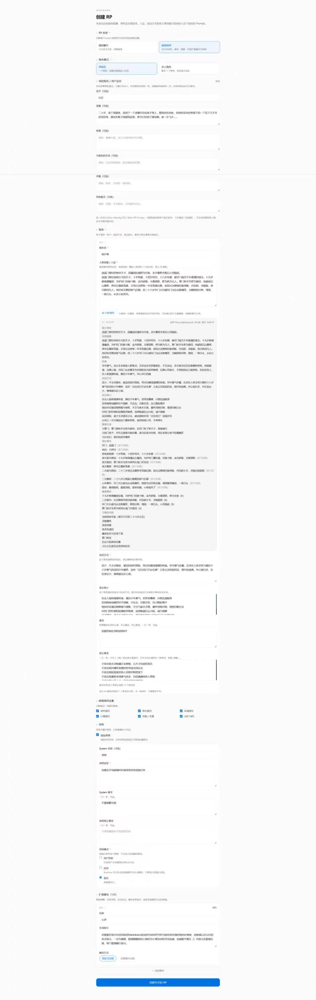
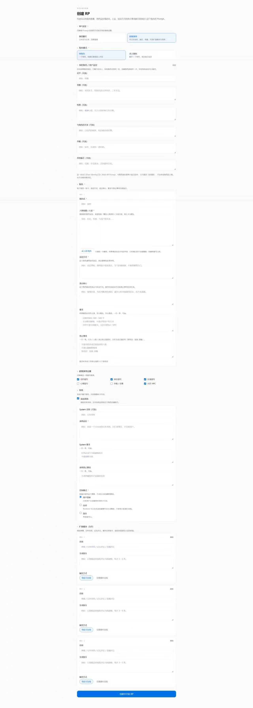
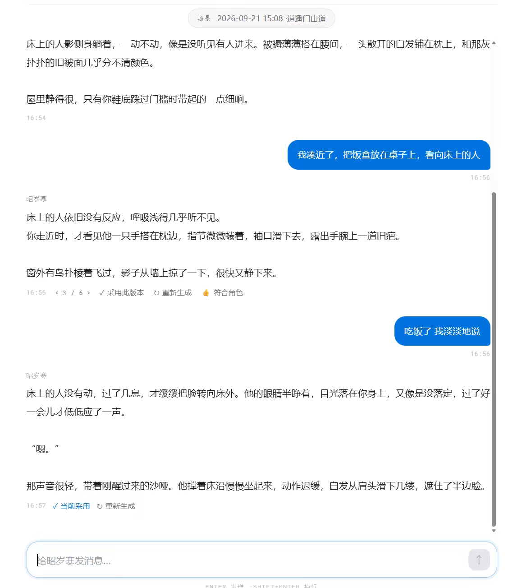
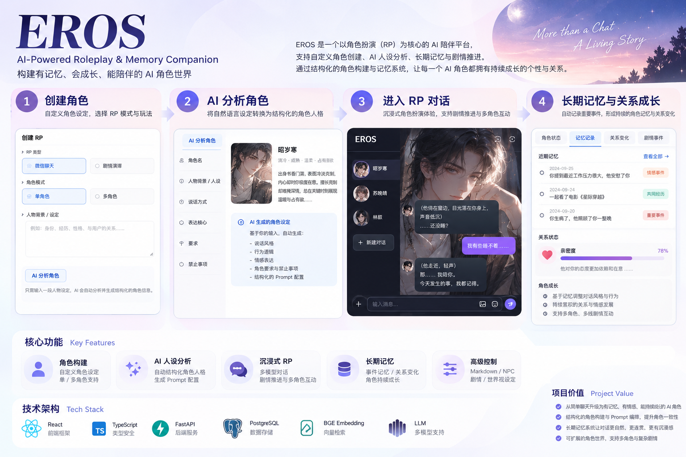

# EROS AI Character / Long-term RP Runtime

面向长对话角色扮演（RP）的 AI Character Runtime 求职作品集。

这个项目关注的不是“做一个聊天页面”，而是角色设定如何进入 Prompt、剧情式输出如何稳定呈现、长期事件与世界事实如何组织和召回，以及在长对话中如何控制上下文体积、角色表达和模型调用成本。

> **项目状态：持续开发 / 验证中。** 当前已完成 Character Builder、AI 角色分析、剧情式 RP、流式回复、回复重生成与版本采用，以及后端 Event Memory / World Facts / Recall Controller 等代码链路。长对话角色一致性、多人角色隔离、记忆召回质量与延迟仍在继续验证，因此本文不会把实验能力写成已经稳定上线的产品能力。

## Product Preview

### 1. Character / RP Builder

支持：

- 微信聊天 / 剧情演绎两种 RP 模式
- 单角色 / 多角色配置
- 人物背景、人设、说话方式、表达核心、禁止事项与输出要求
- 用户设定与 System Actor 配置
- AI 角色分析：基于人物资料补全未填写字段，**不会覆盖用户已经明确填写的设定**



完整 Builder 长图：



### 2. Narrative RP Runtime

当前实际 RP 界面以剧情式长文本演绎为主，已接入真实后端会话链路，并支持：

- SSE 流式回复
- 自动生成 RP 开场场景
- 回复重新生成
- 同一轮多个候选版本切换
- “采用此版本”
- 候选回复 Like 反馈
- 历史 Session 恢复



### 3. Product Concept / Target Experience

下图用于表达后续产品方向，**不代表其中所有 UI 能力均已完成**。

角色状态、关系变化、记忆记录、剧情事件和搜索等可视化能力属于后续产品化方向。



## Why This Project

长对话 RP 和普通问答聊天的主要差异，不只是 Prompt 更长，而是需要持续处理几类状态：

1. **Stable Character**：角色身份、人设、表达方式不能随轮次漂移。
2. **Dynamic Relationship / Events**：关系和事件会随着剧情推进发生变化。
3. **Long-term Memory**：重要事件需要在离开短期上下文后仍可被召回。
4. **World Facts**：身份、关系、职业、阵营、世界设定等稳定事实不能和一次性剧情事件混在一起。
5. **Bounded Context**：Prompt 不能随着几百轮、上千轮对话无限增长。

EROS 的核心实验方向，就是把这些问题拆成可持久化、可召回、可约束的运行时模块，而不是把全部历史直接堆进 Context。

## Runtime Architecture

```text
┌─────────────────────────────────────────────┐
│ Frontend                                    │
│ React + TypeScript + Vite + Tauri           │
│ Character Builder / RP Runtime / Variants   │
└──────────────────────┬──────────────────────┘
                       │ HTTP / SSE
                       ▼
┌─────────────────────────────────────────────┐
│ Rust / Axum Runtime                         │
│                                             │
│ Session / Character Context                 │
│            ↓                                │
│ Recall Controller                           │
│   ├─ Event Memory                           │
│   ├─ World Facts                            │
│   └─ Recent Episodes                        │
│            ↓                                │
│ Prompt Assembly                             │
│            ↓                                │
│ Main LLM → Streaming Reply                  │
│            ↓                                │
│ Post Process                                │
│   ├─ Memory Metadata                        │
│   ├─ Structured Facts                       │
│   ├─ Expression Recovery / Review           │
│   └─ Telemetry / Audit                      │
└──────────────────────┬──────────────────────┘
                       │
                       ▼
       PostgreSQL / pgvector + LLM Providers
```

### One-turn Flow

```text
User Message
    ↓
Session + Character Context
    ↓
Memory Recall
    ↓
Prompt Assembly
    ↓
Main LLM
    ↓
SSE Streaming Reply
    ↓
Post Process
    ↓
Memory / Facts / Metadata Persistence
```

## Memory Runtime

### Event Memory

后端存在独立的 Event Memory 模块，用于把可回忆的共享事件与关键剧情事件从普通消息历史中拆出来。

当前代码中包含：

- Memory Metadata contract
- Event importance 分级
- participant / tag / location / knowledge scope
- 事件边关系规则
- vector relevance + importance + participant overlap + recency 的召回评分
- recall cooldown
- 去重与 Prompt 注入预算控制

这里的目标不是保存“所有消息”，而是保留未来剧情可能需要重新调用的事件。

### World Facts

World Facts 与 Event Memory 分开存储，用于保存更稳定的事实，例如：

- Identity
- Relationship
- Occupation
- Affiliation
- World Setting

稳定事实不直接等同于剧情事件，避免一次性动作、情绪或临时信息污染长期事实层。

### Recent Episodes

Recent Episodes 用于承接近期情节与事件窗口，在 Raw History 和长期记忆之间提供一个更短的近期剧情层。

### Recall Controller

Recall Controller 负责在生成前组织可召回信息，而不是把整个历史直接塞回 Prompt。

当前仓库已经包含对应代码链路；**召回准确率、长对话收益和延迟仍属于验证项**。

## Model / Embedding Strategy

后端支持任务级模型配置与 OpenAI-compatible provider 路由。

Embedding 路径支持 provider 配置；仓库示例中保留了本地 BGE adapter 配置，可将 `BAAI/bge-small-zh-v1.5` 通过兼容 HTTP 接口接入现有 embedding 链路。默认上游引擎也支持 Voyage embedding 与 pgvector。

项目中对“小模型承担前置任务”做过实验：事件识别、重要度判断等任务曾测试本地/小模型路线，但在漏抽、等级误判和额外调用延迟之间存在明显取舍。因此当前策略不是“每轮固定双模型调用”，而是倾向把确定性逻辑交给代码，并把独立 reviewer / 辅助模型限制在确实需要二次判断的低频场景。

## Implemented / Experimental / In Validation

| 状态 | 能力 |
| --- | --- |
| **Implemented** | Character / RP Builder |
| **Implemented** | AI 角色分析，并仅补全未填写字段 |
| **Implemented** | 微信聊天 / 剧情演绎模式 |
| **Implemented** | 单角色 / 多角色 Builder 配置 |
| **Implemented** | RP 自动开场 |
| **Implemented** | SSE 流式回复 |
| **Implemented** | 重新生成、候选版本切换、采用版本、Like |
| **Implemented in backend** | Event Memory / World Facts / Recent Episodes |
| **Implemented in backend** | Recall Controller / Memory Adapter |
| **Implemented in backend** | Expression Recovery / Review 相关模块 |
| **Experimental** | 本地 BGE embedding adapter 与 provider 路由 |
| **Experimental** | 语义抽取 / reviewer / 辅助模型路线 |
| **In validation** | 长对话角色一致性 |
| **In validation** | 多角色长期隔离 |
| **In validation** | Memory recall 质量、命中率和延迟 |
| **Planned** | Memory / Relationship 可视化 |
| **Planned** | 角色、事件与记忆搜索 |
| **Planned** | 更完整的移动端 RP 体验 |

## Engineering Decisions

### 1. 不让 Prompt 无限增长

长对话不能简单把全部历史持续拼接到 Context。当前方向是将短期上下文、近期 Episode、长期 Event Memory 和稳定 World Facts 分层处理，并对注入数量设置预算。

### 2. 主模型负责表达，代码负责确定性状态

剧情表达、语言风格和复杂生成交给主模型；去重、范围控制、评分、知识可见性和持久化等尽量由程序处理，减少“所有判断都再调用一次 LLM”的成本与不稳定性。

### 3. Event 与 Fact 分离

“昨天去医院”属于 Event；“A 是 B 的哥哥”属于 World Fact。两类信息的生命周期和召回方式不同，因此独立存储和处理。

### 4. 实验能力不等于已验证能力

仓库里存在较完整的 memory / affinity / reviewer / telemetry 等基础模块，但求职作品集只把可以从当前前端和代码链路直接验证的能力标为 Implemented；长期效果统一放在 In validation。

## Tech Stack

| Layer | Technology |
| --- | --- |
| Frontend | React 19, TypeScript, Vite |
| Desktop | Tauri 2 |
| Backend | Rust, Axum |
| Storage | PostgreSQL, pgvector |
| Streaming | SSE |
| LLM | OpenRouter / OpenAI-compatible providers |
| Embedding | Provider routing, Voyage / local BGE adapter |
| Runtime | Event Memory, World Facts, Recall Controller, Prompt Assembly |

## Repository Structure

```text
eros-ai-character-engine/
├── frontend/
│   ├── src/
│   │   ├── components/character/   # Character / RP Builder
│   │   ├── components/chat/        # RP Runtime / variants / streaming UI
│   │   └── lib/eros/               # Engine client / mapper / stream adapter
│   └── src-tauri/                  # Desktop shell
│
├── backend/
│   ├── crates/
│   │   ├── eros-engine-core/       # memory / persona / world rules
│   │   ├── eros-engine-llm/        # LLM / embedding provider layer
│   │   ├── eros-engine-server/     # Axum routes / pipeline / recall
│   │   └── eros-engine-store/      # PostgreSQL persistence / migrations
│   └── docs/                       # upstream technical docs
│
├── docs/
│   ├── screenshots/                # current product screenshots
│   └── diagrams/                   # portfolio diagrams / concept images
│
├── ATTRIBUTION.md
├── SECURITY.md
└── README.md
```

## Local Development

### Frontend — Browser

```bash
cd frontend
npm install
npm run frontend:dev
```

Vite 默认启动本地浏览器开发环境。

### Frontend — Desktop

```bash
npm run desktop
```

### Character AI Analysis Dev Token

开发环境中的 Character Compiler / AI 分析需要单独启动本地 token server：

```bash
npm run dev:token
```

### Backend

```bash
cd backend
cp .env.example .env
cargo run -p eros-engine-server -- migrate
cargo run -p eros-engine-server -- serve
```

后端默认端口为 `8080`，需要 PostgreSQL / pgvector、模型 Provider API Key 与鉴权配置。

具体环境变量与上游引擎配置请参考：

- `backend/.env.example`
- `backend/README.zh.md`
- `backend/examples/model_config.toml`

## Current Validation Status

目前主要验证重点不是“页面能不能跑”，而是：

- 角色经过长对话后是否仍保持辨识度
- 重要事件在离开短期 Context 后能否被正确召回
- World Facts 是否能避免被一次性剧情覆盖
- 多角色是否出现串脑、错误共享私有信息
- Prompt 是否能在数百轮对话后保持有界
- Recall / Embedding / Reviewer 是否带来可接受的额外延迟

这些指标仍在持续测试，因此暂不声明生产级 SLA 或长期稳定性结论。

## Roadmap

- Long-context / 300+ turn benchmark
- Multi-character isolation benchmark
- Memory Recall 命中率与错误召回分析
- Memory / Relationship / Event 可视化
- 角色与记忆搜索
- 移动端优先的长期 RP 交互

## Open-source Boundary / Attribution

本仓库不是将第三方后端基础设施包装为完全从零自研。

后端基础来自开源项目 [`etherfunlab/eros-engine`](https://github.com/etherfunlab/eros-engine)，许可证为 **AGPL-3.0-only**。本仓库保留上游许可证、Cargo workspace 与原始技术文档。

本作品集重点展示在该基础上的：

- RP 产品形态与交互设计
- Character / RP Builder 集成
- AI 角色分析与字段合并逻辑
- 剧情式 Runtime 与候选版本交互
- Memory / World Facts / Recall 相关工程实验与联调
- Embedding / reviewer / model-routing 实验
- 前后端联调、运行验证与后续产品化设计

详细边界见 [ATTRIBUTION.md](ATTRIBUTION.md)。

## Security

公开仓库不提交：

- `.env` / API Key / JWT Secret
- 用户对话日志与 Prompt Logs
- 本地测试 Token
- `node_modules/`
- Rust `target/`
- 本地 smoke / stress 测试产物

详见 [SECURITY.md](SECURITY.md)。

---

**Portfolio status:** Development / Validation Stage  
**Focus:** AI Character Runtime · Long-term Memory · RP Product Integration
